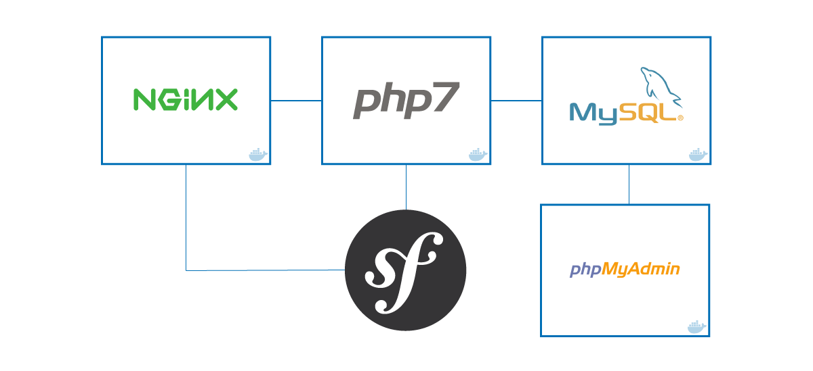

# Docker stack for Symfony projects

For a *more complete* version visit: [Docker-for-Symfony](https://github.com/carlosas/docker-for-symfony)

[](LICENSE)
[](https://github.com/carlosas/docker-for-symfony-lite/issues)
[](http://hits.dwyl.com/carlosas/docker-for-symfony)



## Basic info

* [nginx](https://nginx.org/)
* [PHP-FPM](https://php-fpm.org/)
* [MySQL](https://www.mysql.com/)
* [PHPMyAdmin](https://www.phpmyadmin.net/)

## Previous requirements

This stack needs [docker](https://www.docker.com/) and [docker-compose](https://docs.docker.com/compose/) to be installed.

## Installation

1. Create a `.env` from the `.env.dist` file and adapt it according to the needs of the application

    ```sh
    $ cp .env.dist .env && nano .env
    ```

2. Build/run containers in detached mode (stop any system's ngixn/apache2 service)

    ```sh
    $ docker-compose build
    $ docker-compose up -d
    ```

3. Get the bridge IP address

    ```sh
    $ docker network inspect bridge | grep Gateway | grep -o -E '[0-9\.]+'
    # OR an alternative command
    $ ifconfig docker0 | awk '/inet:/{ print substr($2,6); exit }'
    ```

4. Update your system's hosts file with the IP retrieved in **step 3**.

    ```sh
    $ sudo nano /etc/hosts
    ```

5. Prepare the Symfony application
    1. Update Symfony parameters (*.env* file)

        ```
        #...
        DATABASE_URL=mysql://user:userpass@db:3306/mydb
        #...
        ```

    2. Composer install & update the schema from the container

        ```sh
        $ docker-compose exec php bash
        $ composer install
        $ symfony doctrine:schema:update --force
        ```

5. (Optional) Xdebug: Configure your IDE to connect to port `9001` with key `PHPSTORM`

## How does it work?

We have the following *docker-compose* built images:

* `nginx`: The Nginx webserver container in which the application volume is mounted.
* `php`: The PHP-FPM container in which the application volume is mounted too.
* `db`: The MySQL database container.
* `phpmyadmin`: The PHPMyAdmin server/administration container.

Running `docker-compose ps` should result in the following running containers:

```
           Name                          Command               State              Ports
--------------------------------------------------------------------------------------------------
container_mysql         /entrypoint.sh mysqld            Up      0.0.0.0:3306->3306/tcp
container_nginx         nginx                            Up      443/tcp, 0.0.0.0:80->80/tcp
container_phpfpm        php-fpm                          Up      0.0.0.0:9000->9000/tcp
container_phpmyadmin    /run.sh phpmyadmin               Up      0.0.0.0:8080->80/tcp
```

## Usage

Once all the containers are up, our services are available at:

* Symfony app: [symfony.dev](http://symfony.dev)
* PHPMyAdmin: [symfony.dev:8080](http://symfony.dev:8080)
* Log files location: *logs/nginx* and *logs/symfony*

:tada: Now we can stop our stack with `docker-compose down` and start it again with `docker-compose up -d`.
